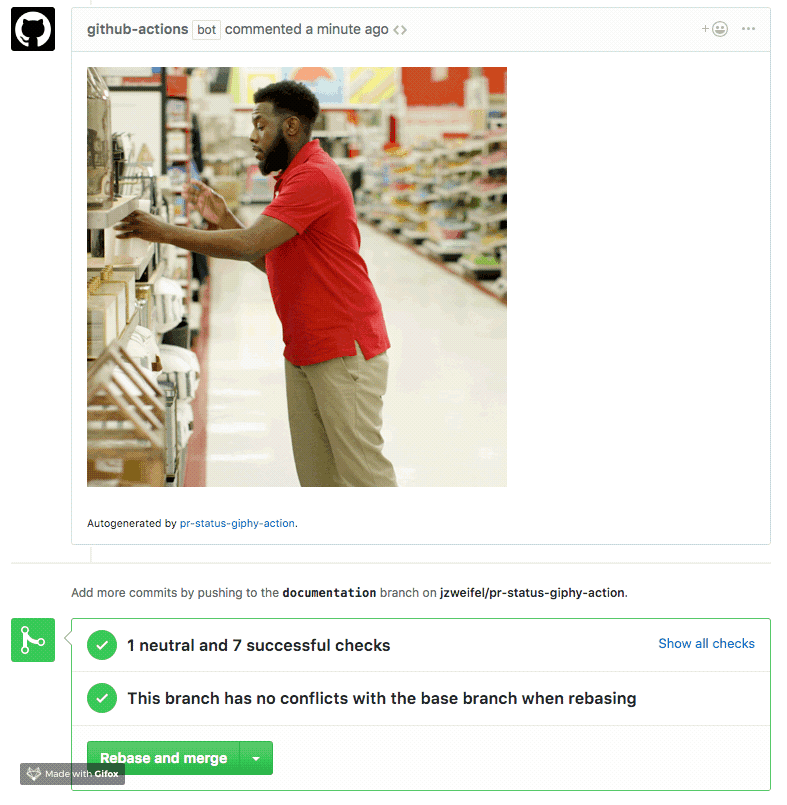
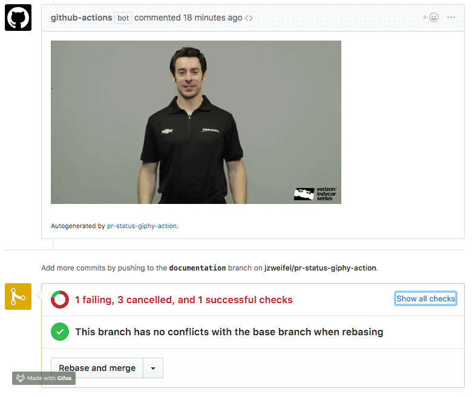

# Pull Request Status Giphy Action Fork - Image URL Update for GitHub

A GitHub Action that displays a random thumbs up or thumbs down gif from Giphy when all checks on a Pull Request complete.

It will automatically clean up an existing comment before making a new one if checks are re-run.

Works best when used in a workflow that runs on the `pull_request` event.





## Usage

```
on: pull_request
name: Pull Request Status Checks
jobs:
  pRStatusGiphy:
    name: PR Status Giphy
    runs-on: ubuntu-latest
    steps:
    - name: PR Status Giphy
      uses: jzweifel/pr-status-giphy-action@master
      env:
        GIPHY_API_KEY: ${{ secrets.GIPHY_API_KEY }}
        GITHUB_TOKEN: ${{ secrets.GITHUB_TOKEN }}
```

### Secrets

- `GITHUB_TOKEN` - **Required**.
- `GIPHY_API_KEY` - **Required**. Your secret Giphy Api Key. You can create this key [here](https://developers.giphy.com/dashboard/?create=true).

## License

The Dockerfile and associated scripts and documentation in this project are released under the [MIT License](LICENSE).

Container images built with this project include third party materials. See [THIRD_PARTY_NOTICE.md](THIRD_PARTY_NOTICE.md) for details.
